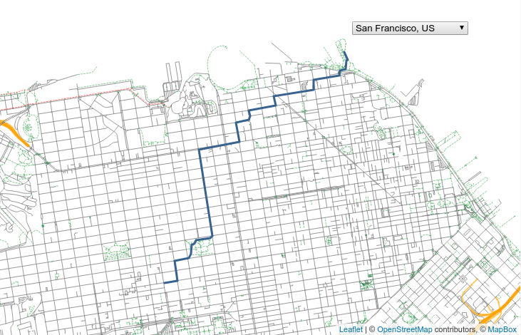

## Demonstrator
{:#demonstrator}

A server instance is set up publishing data for *the entire world*.
Entry points into the hypermedia API can be found through [https://tiles.openplanner.team/planet/14/{x}/{y}/ (e.g., with x 8411 and y 5485](https://tiles.openplanner.team/planet/14/8411/5485/).
A live demonstrator using this data can be found at [https://openplannerteam.github.io/leaflet-routable-tiles/](https://openplannerteam.github.io/leaflet-routable-tiles/).

The demonstrator shows a map of all roads (in Portorož by default) in the viewport.
The map is drawn on the client-side based on the JSON-LD documents fragmented in tiles.
When clicking 2 locations on the map, the same JSON-LD documents are used to perform a Dijkstra shortest path algorithm.

<figure id="listing2" class="noprint">
<!---->
<iframe class="noprint" src="https://openplannerteam.github.io/leaflet-routable-tiles/#latitude=45.515570&longitude=13.595109" style="width: 100%; height: 50vh;">
</iframe>
<figcaption>A demonstrator of what you can do with Routable Tiles. You can pan around, select another city, and calculate a shortest path. Both rendering the map and the route planning happens on the client-side while loading the tiles dynamically.</figcaption>
</figure>
